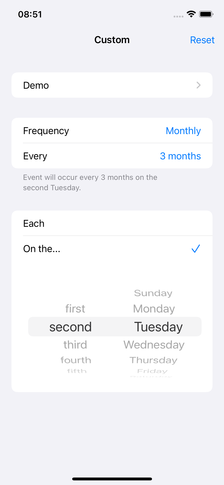
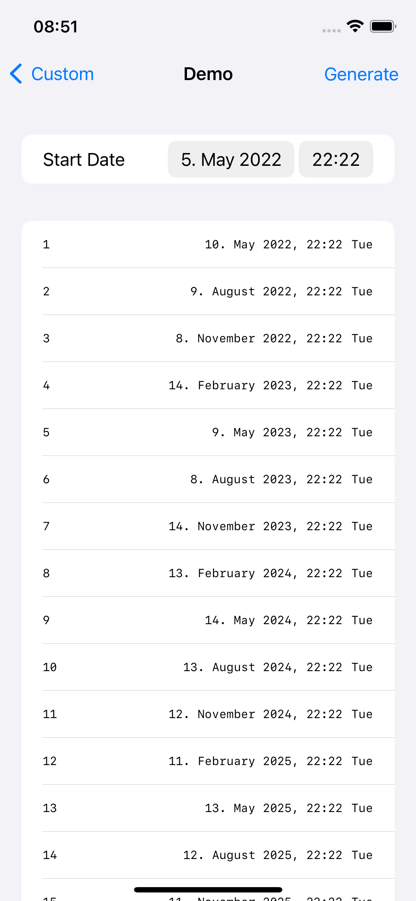

# custom-repeat-date

[](https://github.com/pixyzehn/custom-repeat-date/actions/workflows/ci.yml)
[](https://swiftpackageindex.com/pixyzehn/custom-repeat-date)
[](https://swiftpackageindex.com/pixyzehn/custom-repeat-date)

A simple date extension that easily allows you to provide custom repeat date options for the Gregorian calendar. The package has been created and used for [Expenses.app](https://getexpenses.app), inspired by [Apple Reminders](https://apps.apple.com/us/app/reminders/id1108187841) and [Bluebird](https://bluebird.app).

## Usage

```swift
let option = CustomRepeatDateOption.monthly(frequency: 3, option: .daysOfWeek(weekdayOrdinal: .second, weekday: .tuesday))
let calendar = Calendar(identifier: .gregorian)

let startDate = date(year: 2022, month: 5, day: 5)                 // 2022-05-05 22:22:22 +0000
let repeat1 = calendar.nextDate(after: startDate, option: option)! // 2022-05-10 22:22:22 +0000
let repeat2 = calendar.nextDate(after: repeat1, option: option)!   // 2022-08-09 22:22:22 +0000
let repeat3 = calendar.nextDate(after: repeat2, option: option)!   // 2022-11-08 22:22:22 +0000
let repeat4 = calendar.nextDate(after: repeat3, option: option)!   // 2023-02-14 22:22:22 +0000
let repeat5 = calendar.nextDate(after: repeat4, option: option)!   // 2023-05-09 22:22:22 +0000
```

To see how it works in practice, check out [Examples](./Examples).

ex. 1 | ex. 2
---- | ----
 | 

## Converting Documentation

```shell
swift package --allow-writing-to-directory ./docs \
    generate-documentation --target CustomRepeatDate --output-path ./docs \
    --transform-for-static-hosting --hosting-base-path custom-repeat-date
```

## Previewing Documentation

```shell
swift package --disable-sandbox preview-documentation --product CustomRepeatDate
```

See also [apple/swift-docc-plugin](https://github.com/apple/swift-docc-plugin) for more information.
